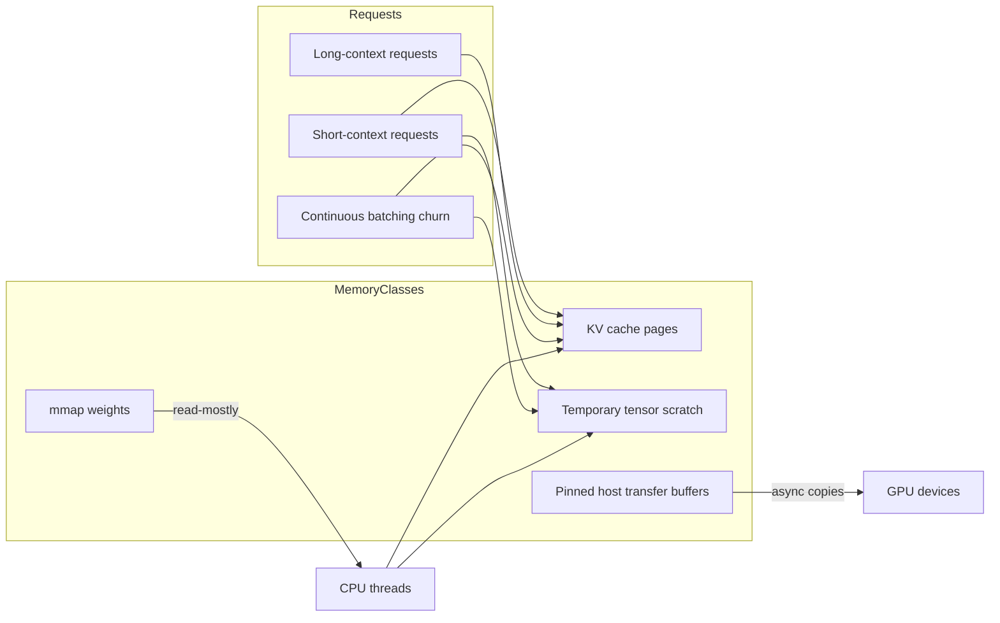
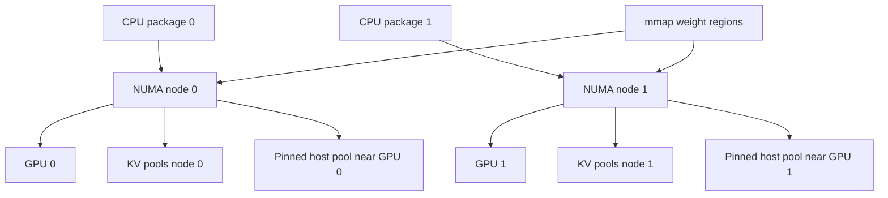

## Executive summary

A NUMA-aware allocator for AI inference is worth building because modern inference workloads are not “just large tensors.” They are a moving mix of read-mostly `mmap`-backed weights, dynamically growing KV caches, short-lived temporary tensors, pinned host buffers for GPU transfers, and request scheduling patterns such as continuous batching that constantly change memory pressure over time. In large-language-model serving, the KV cache grows token by token during generation, and inefficient KV allocation wastes memory through fragmentation and over-reservation; this was the core motivation behind PagedAttention and vLLM, which reported near-zero KV waste and large throughput gains relative to prior systems, especially on longer sequences and larger models. The same workload properties make NUMA locality materially important on multi-socket CPU servers and GPU servers where each GPU is closer to some CPU cores and memory controllers than others. citeturn11search0turn12search2turn12search4turn11search6turn29search4turn11search7

The right design is not a single “malloc replacement.” A feasible and strong open-source approach is a **memory runtime** with several specialized allocators behind one placement API: a read-mostly weight mapper for `mmap` and huge-page-aware file mappings; a page/block allocator for KV cache with fixed-size blocks and explicit reuse; a scratch allocator for temporary tensors built from per-thread arenas and per-node pools; and a pinned-host subsystem for GPU staging buffers. Linux already provides nearly all the substrate: `mmap`, `mbind`, `set_mempolicy`, `move_pages`, `memfd_create`, `madvise`, `mlock`, hugetlb/THP support, `perf_event_open`, `/proc/<pid>/numa_maps`, `/sys/devices/system/node/*/numastat`, cgroup v2 `memory.current`, `memory.high`, `memory.max`, and `memory.numa_stat`. GPU locality can be derived from PCI sysfs (`numa_node`, `local_cpulist`), hwloc’s topology graph, and NVIDIA NVML’s CPU/memory-affinity and GPU-topology APIs. citeturn17search0turn37search0turn36view0turn35view0turn32view0turn33view1turn33view2turn33view3turn30search1turn30search5turn31view1turn31view0turn31view2turn6search3turn7search5turn5search9turn10view2turn10view3

The most practical implementation path in Rust is to push `unsafe` to a narrow substrate layer and keep the public API explicit rather than magical. Model the runtime around owned region handles and typed buffers, not a global allocator override. Use `NonNull<T>` for owned raw memory handles, `Layout` for size/alignment contracts, and `Drop` for deterministic cleanup; keep FFI shims isolated in a `sys` module for Linux NUMA and optional CUDA/NVML integration. This keeps correctness tractable while still enabling high-performance specialization. citeturn27view0turn28view0turn28view1turn28view2

My recommended v0.1–v0.3 plan is: first ship topology discovery, policy selection, and a NUMA-aware scratch allocator; then add a production KV block allocator with reuse and observability; then add pinned-host plus `mmap`-weight management and framework integrations. Candle and Burn are the most natural early Rust integrations; llama.cpp is an excellent interoperability target because it already exposes `mmap`, `mlock`, KV cache controls, and NUMA-related runtime options; vLLM integration is feasible, but more likely through a C ABI, sidecar runtime, or a shared-memory/pinned-buffer service than by replacing Python/CUDA internals directly. citeturn14search0turn16search0turn16search12turn19view0turn11search1turn14search6

## Workload motivation and memory behavior

AI inference memory behavior is heterogeneous enough that a general-purpose allocator rarely matches it well. Four classes dominate: read-mostly model weights, which are excellent candidates for file-backed `mmap`; KV cache, which grows incrementally with generated tokens; temporary tensors, whose lifetimes are usually bounded by an operator, a fused operator group, or one decode step; and host-side staging buffers for device transfer, which often need page-locked memory for asynchronous H2D/D2H copies. CUDA’s documentation is explicit that page-locked host memory is required for asynchronous CPU↔GPU copies, improves synchronous copy performance, and can be mapped for direct GPU access; it also warns that allocating too much pinned memory degrades system performance. citeturn10view0turn10view1

For LLM serving, the KV cache is the most allocator-specific pain point. Hugging Face’s cache documentation explains that at inference time each new step appends fresh keys and values to the past cache, so the cache grows as generation progresses; the default dynamic cache stores per-layer tensors with shape like `[batch_size, num_heads, seq_len, head_dim]`. Hugging Face also notes that self-attention costs grow sharply with sequence length, which is why long context magnifies memory pressure. citeturn12search2turn12search4turn12search12turn12search6

Long and short contexts create pathological coexistence. A server that mixes requests with tiny prompts and massive contexts cannot reserve one monolithic KV region per request without either wasting space or imposing expensive compaction and reshaping. The vLLM paper highlighted exactly this issue: KV cache memory is large, grows and shrinks dynamically, and can be heavily wasted by fragmentation and redundant duplication; PagedAttention addressed this by allocating KV in fixed blocks accessed through indirection rather than insisting on one contiguous layout. citeturn11search0turn11search7

Batch churn makes this harder. Orca’s iteration-level scheduling and selective batching show why static “start batch, finish batch” memory plans are a poor fit for generative serving: requests enter and leave at iteration granularity, so allocation pressure changes continuously rather than only at request boundaries. A NUMA-aware runtime has to assume that temporary tensors and some KV pages will be allocated under churn, while weights remain largely stable and read-mostly. citeturn11search6

A useful mental model is therefore:

- **Weights:** large, mostly immutable, excellent for `mmap`, sometimes worth `mlock` selectively.
- **KV cache:** medium/large, append-heavy, reused across decode steps, often best as fixed-size pages/blocks.
- **Scratch tensors:** short-lived, high churn, best from arenas/bump allocators with very cheap reset.
- **Pinned transfer buffers:** moderate-sized, bounded pools, carefully throttled because page-locked memory is expensive to the OS. citeturn17search0turn33view2turn10view1turn11search0

The implication for NUMA is straightforward: a single process can be perfectly correct yet slow if its compute threads run near one socket while its anonymous pages fault on another, or if a GPU is fed by host buffers allocated on the wrong NUMA node. Linux NUMA documentation describes locality in precisely those terms: memory is split into nodes, and access time depends on the relative locations of the CPU and the node serving the memory. citeturn29search4



## NUMA topology, Linux substrate, and locality discovery

Linux gives you three complementary ways to discover and reason about topology: direct sysfs/procfs inspection, libnuma/syscalls, and hwloc. hwloc’s purpose is to provide a portable hierarchical map of NUMA nodes, packages, cores, caches, and I/O devices, and it explicitly supports CPU binding and memory binding. On Linux, sysfs exposes PCI device locality via attributes such as `/sys/bus/pci/devices/.../numa_node`, which the kernel documents as the node attached to the PCI device, or `-1` if the node is unknown; drivers and documentation also commonly refer to `local_cpulist` for the CPUs local to a device. citeturn5search9turn5search4turn6search3turn7search5turn7search6

The kernel’s memory-policy model is also highly usable from userspace. `set_mempolicy(2)` defines per-thread default policy, while `mbind(2)` defines policy for a virtual-address range. The system default is local allocation; `MPOL_BIND` restricts allocations to specified nodes; `MPOL_INTERLEAVE` spreads them across nodes; `MPOL_WEIGHTED_INTERLEAVE` does so according to weights; `MPOL_PREFERRED` prefers one node but falls back; `MPOL_PREFERRED_MANY` prefers a set of nodes; and `MPOL_LOCAL` explicitly requests local allocation. `mbind(2)` applies policy to a region, while `set_mempolicy(2)` governs the rest of the address space outside more specific bindings. citeturn36view0turn37search0turn37search7

The most important operational subtlety is that NUMA policy is about **page allocation**, not virtual addresses. That means address ranges become physically local or remote when pages are actually instantiated, faulted, or migrated. Linux provides several ways to inspect the result after the fact: `/proc/<pid>/numa_maps` shows the policy and per-node allocation for each mapping; `/sys/devices/system/node/node*/numastat` exposes `numa_hit`, `numa_miss`, `numa_foreign`, `local_node`, `other_node`, and `interleave_hit`; and cgroup v2 `memory.numa_stat` breaks down memory footprint per node for the cgroup. citeturn30search1turn30search5turn31view2

### Linux API and kernel feature map

| Facility | What it is good for | Key caveat |
|---|---|---|
| `mmap` | File-backed weights, anonymous arenas, shared memory regions | Placement still depends on page allocation/fault behavior unless you add policy and prefault strategy |
| `mbind` | Apply NUMA policy to one virtual range | Best for region-specific allocators, not whole-process defaults |
| `set_mempolicy` | Apply thread default policy | Governs allocations outside `mbind`-controlled ranges |
| libnuma | Higher-level helpers like alloc-on-node and bind/prefer APIs | Linux-specific dependency |
| `move_pages` | Query page location or migrate selected pages | Migration can fail for busy/shared/dirty pages |
| `madvise` | THP hints, collapse, readahead-related behavior, locality hints | Advice is advisory, not a strict guarantee |
| `mlock` / `mlock2` | Keep selected pages resident, optionally on fault | Easy to overuse; can harm system flexibility |
| `memfd_create` | Anonymous RAM-backed files, shared-memory objects, sealing | Needs explicit sizing and policy handling |
| `MAP_HUGETLB` / hugetlbfs | Deterministic explicit huge pages | Operationally heavier; capacity must exist up front |
| Transparent Huge Pages | Opportunistic huge pages for eligible mappings | Can help or waste memory depending on access pattern |
| cgroup v2 memory controller | Limit, throttle, and observe memory in containers | Must be interpreted alongside locality metrics |
| `perf_event_open` | Collect page faults, cache, TLB, and CPU metrics | Needs careful experimental design |

The table above is based on Linux man pages and kernel documentation for `mmap`, `mbind`, `set_mempolicy`, `move_pages`, `madvise`, `mlock`, `memfd_create`, hugetlb, THP, cgroup v2, and `perf_event_open`. citeturn17search0turn37search0turn36view0turn35view0turn33view1turn33view2turn32view0turn33view0turn4search1turn4search0turn31view1turn31view0turn31view2turn33view3

For huge pages, Linux supports both explicit hugetlb mappings and THP. `MAP_HUGETLB` creates mappings using huge pages, with alternatives such as 2 MB and 1 GB sizes when supported. `MADV_HUGEPAGE` enables THP for eligible regions, and since Linux 5.4 the automatic scan/collapse path also supports private anonymous memory, shmem, and some file-backed mappings subject to alignment and mapping constraints. This distinction matters for AI inference: hugetlb is better when you can reserve capacity and care about predictability; THP is better when you want opportunistic wins without requiring pre-reserved pools. citeturn33view0turn33view1turn4search0turn4search1

For locked memory, `mlock()` guarantees the pages stay resident in RAM until unlocked, while `mlock2(..., MLOCK_ONFAULT)` lets you mark a region so that nonresident pages are locked as they fault in. That makes `mlock2` useful for “critical but sparse” working sets, though it should be used surgically rather than globally. citeturn33view2

For anonymous shared objects and read-mostly replicated control structures, `memfd_create()` is particularly attractive. It creates an anonymous RAM-backed file descriptor that can be truncated, memory-mapped, and optionally sealed; it also supports hugetlb-backed anonymous files via `MFD_HUGETLB`. In practice, this is a strong building block for shared metadata, frozen page tables for KV management, and application-level replicated read-mostly tables where you want file-descriptor semantics without a visible filesystem path. citeturn32view0

For observability, `perf_event_open()` exposes one-event-per-file-descriptor counters, and Linux defines software events for page faults, minor page faults, and major page faults. Combined with hardware cache and TLB events plus NUMA hit/miss counters and `numa_maps`, these are enough to decide whether an allocator change improved locality or merely changed fragmentation. citeturn33view3turn34view0turn34view1turn34view2turn30search5turn30search1

## GPU locality and near-GPU placement

On GPU servers, the correct NUMA node is often “the node nearest the target GPU,” not simply “the node where the main thread started.” CUDA’s programming documentation distinguishes pageable host memory from page-locked host memory and states that mapped page-locked memory can be directly accessed from GPU kernels; the runtime API further documents `cudaHostAllocMapped`, `cudaHostRegisterMapped`, `cudaHostGetDevicePointer`, and write-combined host allocations for CPU-write/GPU-read staging buffers. These are exactly the interfaces you need when building a host-side pool for asynchronous transfer and occasional zero-copy access. citeturn10view0turn10view1

NVIDIA’s NVML provides the second half of the picture: affinity and topology. The API exposes CPU and memory affinity scopes at the NUMA-node or socket level, and topology functions such as `nvmlDeviceGetTopologyCommonAncestor`; NVIDIA’s current documentation also lists `nvmlDeviceGetTopologyNearestGpus` and `nvmlSystemGetTopologyGpuSet` among the topology-oriented capabilities. In other words, NVML can tell you which CPUs and GPUs are topologically close, while Linux sysfs tells you which NUMA node a PCI device belongs to. citeturn10view2turn10view3turn9search6turn6search3

A practical **near-GPU policy** is therefore an application-level derived policy:

1. discover the target GPU’s PCI bus ID and NVML affinity;
2. read `/sys/bus/pci/devices/<BDF>/numa_node` and optionally `local_cpulist`;
3. pin feeder/host-side copy threads to those CPUs;
4. allocate pinned host buffers on that NUMA node using `mbind`/`set_mempolicy`/libnuma before registration or with region pinning after mapping;
5. use zero-copy only for control paths or bandwidth-light access, not as the default for hot tensor compute, because mapped host memory remains host memory, not device DRAM. citeturn10view1turn10view2turn10view3turn6search3turn7search5turn5search9

This is also where hwloc is useful even if you already have sysfs and NVML. hwloc can represent NUMA nodes, CPU packages, caches, and I/O devices in one graph, making it easier to build a portable scheduler that decides, for example, that GPU0’s H2D staging pool lives on node 1 while GPU1’s lives on node 3. citeturn5search9turn5search4



The important design conclusion is that “near-GPU” is not a kernel mempolicy mode in the way `MPOL_BIND` or `MPOL_INTERLEAVE` is. It is a **placement policy synthesized by your runtime** from GPU and PCI topology, then enacted with standard NUMA APIs. Linux exposes preferred, bind, interleave, local, and related modes; replication and near-GPU must be implemented above that layer. citeturn36view0turn10view2turn6search3

## Allocator architecture, policies, fragmentation control, and KV reuse

The most robust design is to separate memory classes by lifetime and placement rather than force every allocation through one mechanism. Arena and bump allocators are ideal for temporaries because their dominant operation is reset, not arbitrary free. Slab/size-class allocators are good for many small fixed-size metadata objects. Buddy-style page allocators are strong for medium-to-large page blocks needing coalescing. Segregated fits remain a reasonable fallback for general-purpose host objects. For scalable concurrency, the allocator literature repeatedly converges on per-CPU or per-thread caches, local heaps or arenas, and limited sharing in the fast path: Bonwick’s slab allocator centered object caches, Bonwick and Adams added magazines to scale across CPUs, jemalloc emphasized fragmentation avoidance plus scalable concurrency, Hoard used global plus per-processor heaps to bound blow-up and reduce false sharing, and mimalloc uses sharded free lists, low contention, and bounded overhead. citeturn22search2turn22search8turn20search14turn20search10turn23search1turn23search8turn20search7turn20search11

For AI inference, the clean decomposition is:

### Allocator classes and where they fit

| Strategy | Best fit in this runtime | Strength | Weakness |
|---|---|---|---|
| Bump / arena | Per-step temporary tensors | Near-zero metadata overhead, reset is constant-time | Poor for arbitrary frees |
| Slab / size classes | Metadata, small descriptors, request structs | Fast fixed-size alloc/free, cache-friendly | Internal fragmentation when object sizes drift |
| Buddy page allocator | KV pages, large tensor blocks, pinned pool backing | Natural split/coalesce, page-aligned | Internal fragmentation at powers of two |
| Segregated fits | Fallback “misc” buffer classes | Flexible, good average behavior | Harder to make policy-aware and predictable |
| Page pool | Reusable homogeneous KV blocks or staging buffers | Excellent reuse and locality control | Requires careful sizing choices |
| Lock-free freelists | Remote returns, per-class global refill path | Low uncontended overhead | ABA/reclamation complexity |

The comparison above is grounded in classic slab and scalable-allocator work together with modern production allocators. citeturn22search2turn22search8turn20search10turn23search1turn20search11turn20search7

A good policy stack is:

### Practical NUMA policies

| Policy name in runtime | Linux realization | Good use case | Notes |
|---|---|---|---|
| local | `MPOL_LOCAL` or default local allocation | Scratch tensors, per-thread arenas | Best latency when work stays pinned |
| bind | `MPOL_BIND` | GPU staging near one GPU, strict KV shard locality | Strictest placement, can fail under pressure |
| prefer | `MPOL_PREFERRED` | Read-heavy pools that should stay mostly local | Falls back gracefully |
| prefer-many | `MPOL_PREFERRED_MANY` | Tiered preferences, mixed CPU/GPU memory types | Useful on newer kernels |
| interleave | `MPOL_INTERLEAVE` | Bandwidth-oriented scratch or large scans | Helps bandwidth, hurts single-page latency |
| weighted-interleave | `MPOL_WEIGHTED_INTERLEAVE` | Skewed scratch placement under asymmetric nodes | Requires Linux support and policy files |
| replicate | application-managed duplicate or shared read-only maps | Tiny read-mostly tables, weight headers, vocab metadata | Not a generic kernel policy |
| near-gpu | derive nearest node via NVML/sysfs/hwloc, then bind/prefer there | Pinned host buffers and feeder threads | Runtime policy, not kernel primitive |

This table summarizes Linux memory-policy semantics plus the derived higher-level policies that a serving runtime typically needs. citeturn36view0turn10view2turn10view3turn6search3turn5search9

### What to do with each AI memory class

**Weights.** Default to `mmap` for large immutable model files. Keep them file-backed and demand-paged; use `MAP_POPULATE` or selective warmup only when cold-start latency matters more than memory burst. Evaluate THP for eligible file-backed mappings, but do not assume it will always help; for very large stable models on dedicated nodes, hugetlb-backed approaches are worth benchmarking. If you lock weights with `mlock`, do it selectively and make it operator-configurable because locked pages reduce system flexibility. llama.cpp’s runtime options are a useful real-world reference here: it exposes `--mmap`, `--mlock`, and NUMA-related controls separately rather than pretending one setting is always optimal. citeturn33view0turn33view1turn33view2turn19view0

**KV cache.** Use fixed-size pages or blocks, not one contiguous vector per request. The basic shape should resemble a paged virtual-memory abstraction: a logical sequence maps to a block table, and blocks are drawn from per-node pools. The right block size is operational rather than universal, but a good starting rule is “large enough to amortize metadata, small enough to contain internal fragmentation and permit reuse.” In practice, that usually means sizing in multiples of the OS page size and often aligning block size to 2 MB THP boundaries only if decode access patterns and compaction behavior justify it. The vLLM result is the key design clue here: block-level KV management is fundamentally more allocator-friendly than monolithic reservations. citeturn11search0turn12search10

**Temporary tensors.** Use one or more per-thread arenas backed by per-node region pools. Reset at the end of an operator group, decode step, or request-iteration boundary rather than issuing general frees. If you need large temporary tensors, round them to page boundaries and pull from a per-node page pool so they do not contaminate the small-object path. citeturn22search8turn20search11turn20search10

**Pinned buffers.** Manage these as bounded node-local pools, not ad hoc `cudaHostAlloc` calls sprinkled through the codebase. CUDA explicitly warns against excessive page-locked memory. Register-once, recycle-many is the safest default. Use write-combined allocations for CPU-write/GPU-read staging when profiling shows it helps, and keep explicit metrics for pinned bytes per node and pinned-bytes-per-GPU. citeturn10view1

Fragmentation control should also be specialized by class. Scratch arenas avoid fragmentation by construction. KV uses fixed-size blocks and request-local block tables, which turns “contiguity” from a physical property into a logical one. Large object pools should return whole extents to per-node page pools and optionally coalesce buddy-adjacent extents. For spillover, prefer **remote-but-known** over allocator chaos: if node 0’s KV pool is full, either allocate from the preferred fallback set using `MPOL_PREFERRED_MANY` or declare backpressure, rather than silently expanding miscellaneous heaps. citeturn36view0turn23search1turn20search14

For concurrency, the most convincing pattern is: per-thread arenas for scratch, per-node pools for page/block resources, and a narrow global slow path for refill and scavenging. Any lock-free shared free list should use an explicit reclamation strategy. In Rust, epoch-based reclamation or narrow ownership transfer rules are far easier to reason about than ad hoc lock-free pointer gymnastics; Loom is a good fit for checking small concurrent components because it explores many possible concurrent executions under the C11-style memory model. citeturn23search14turn38search1turn38search10

## Rust API, ABI, crate structure, and implementation sketches

The API should be explicit about **class**, **placement**, and **lifetime**. Avoid the temptation to start with a process-wide `GlobalAlloc` replacement. That path makes attribution and policy control harder, especially across FFI boundaries. A better early API is something like:

- `Topology` - discover NUMA nodes, CPU sets, GPUs, and PCI locality.
- `Policy` - `Local`, `Bind(NodeSet)`, `Prefer(Node)`, `PreferMany(NodeSet)`, `Interleave(NodeSet)`, `NearGpu(GpuId)`.
- `Arena` - scratch allocator with reset semantics.
- `TensorBuffer` - typed or byte-oriented explicit buffer with `Layout` and placement metadata.
- `KvBlockPool` - fixed-size block pool keyed by node and block class.
- `PinnedHostPool` - CUDA/NVML-optional page-locked buffer pool.
- `WeightMap` - file-backed or memfd-backed mapped region manager. citeturn27view0turn28view0turn28view1turn28view2

A good crate split is:

```text
numa-runtime/
  crates/
    numa-runtime-sys/        # FFI bindings: libc, libnuma, optional nvml/cuda
    numa-runtime-topology/   # sysfs + hwloc + NVML discovery
    numa-runtime-core/       # Policy, node sets, errors, metrics traits
    numa-runtime-alloc/      # arenas, pools, KV blocks, weight maps
    numa-runtime-capi/       # stable C ABI
    numa-runtime-prom/       # Prometheus exporter helpers
```

Keep `unsafe` almost entirely inside `sys`, page-map primitives, and a handful of raw-allocation internals. Rust’s `NonNull<T>` is particularly useful for owned raw allocations because it encodes non-nullness and preserves niche optimization; `Layout` gives you checked size/alignment contracts; and `Drop` gives deterministic cleanup of mapped regions, registered pinned memory, or NUMA-bound allocations. The Rustonomicon’s FFI guidance is also directly relevant: use C ABIs, avoid crossing C++ directly, and keep callback lifetimes and destruction sequencing very explicit. citeturn27view0turn28view0turn28view1turn28view2

### Topology discovery sketch

```rust
use std::collections::BTreeMap;
use std::fs;
use std::io;
use std::path::{Path, PathBuf};

#[derive(Debug, Clone)]
pub struct NumaNodeInfo {
    pub node_id: u32,
    pub cpulist: String,
}

#[derive(Debug, Clone)]
pub struct PciDeviceInfo {
    pub bdf: String,
    pub numa_node: i32,
    pub local_cpulist: Option<String>,
}

#[derive(Debug, Default)]
pub struct Topology {
    pub nodes: Vec<NumaNodeInfo>,
    pub pci_devices: BTreeMap<String, PciDeviceInfo>,
}

fn read_trimmed(path: &Path) -> io::Result<String> {
    Ok(fs::read_to_string(path)?.trim().to_string())
}

pub fn discover_topology() -> io::Result<Topology> {
    let mut topo = Topology::default();

    let node_root = Path::new("/sys/devices/system/node");
    if node_root.exists() {
        for entry in fs::read_dir(node_root)? {
            let entry = entry?;
            let name = entry.file_name();
            let name = name.to_string_lossy();
            if let Some(id) = name.strip_prefix("node").and_then(|s| s.parse::<u32>().ok()) {
                let cpulist = read_trimmed(&entry.path().join("cpulist")).unwrap_or_default();
                topo.nodes.push(NumaNodeInfo { node_id: id, cpulist });
            }
        }
        topo.nodes.sort_by_key(|n| n.node_id);
    }

    let pci_root = Path::new("/sys/bus/pci/devices");
    if pci_root.exists() {
        for entry in fs::read_dir(pci_root)? {
            let entry = entry?;
            let bdf = entry.file_name().to_string_lossy().to_string();
            let numa_node = read_trimmed(&entry.path().join("numa_node"))
                .ok()
                .and_then(|s| s.parse::<i32>().ok())
                .unwrap_or(-1);
            let local_cpulist = read_trimmed(&entry.path().join("local_cpulist")).ok();
            topo.pci_devices.insert(
                bdf.clone(),
                PciDeviceInfo { bdf, numa_node, local_cpulist },
            );
        }
    }

    Ok(topo)
}
```

This sketch uses the kernel’s sysfs interfaces for node CPU lists and PCI device NUMA attachment. In production, I would add optional hwloc/NVML enrichers on top. citeturn6search3turn7search5turn5search9

### FFI surface sketch for libnuma and memory policy

```rust
use libc::{c_int, c_ulong, c_void};
use std::io;
use std::ptr::NonNull;

#[link(name = "numa")]
unsafe extern "C" {
    fn numa_available() -> c_int;
}

unsafe extern "C" {
    fn set_mempolicy(mode: c_int, nodemask: *const c_ulong, maxnode: c_ulong) -> c_int;
    fn mbind(
        addr: *mut c_void,
        len: libc::size_t,
        mode: c_int,
        nodemask: *const c_ulong,
        maxnode: c_ulong,
        flags: c_uint,
    ) -> c_int;
}

const MPOL_BIND: c_int = 2;
const MPOL_PREFERRED: c_int = 1;

pub fn numa_supported() -> bool {
    unsafe { numa_available() >= 0 }
}

pub fn set_preferred_node(mask_words: &[c_ulong]) -> io::Result<()> {
    let rc = unsafe { set_mempolicy(MPOL_PREFERRED, mask_words.as_ptr(), (mask_words.len() * 8 * std::mem::size_of::<c_ulong>()) as c_ulong) };
    if rc == 0 { Ok(()) } else { Err(io::Error::last_os_error()) }
}
```

The syscall and libnuma interfaces are Linux-specific, which is one reason to hide them behind a small `sys` crate and expose a portable policy enum from the main API. citeturn29search0turn36view0turn37search0

### `NumaArena` sketch

```rust
use libc::{
    c_void, mmap, munmap, madvise, mlock2, MAP_ANONYMOUS, MAP_PRIVATE, PROT_READ, PROT_WRITE,
    MADV_HUGEPAGE, MLOCK_ONFAULT, MAP_FAILED,
};
use std::alloc::Layout;
use std::io;
use std::ptr::NonNull;

pub struct NumaArena {
    base: NonNull<u8>,
    cap: usize,
    offset: usize,
    node: u32,
}

impl NumaArena {
    pub fn new(cap: usize, node: u32, hugepage_hint: bool, lock_on_fault: bool) -> io::Result<Self> {
        let ptr = unsafe {
            mmap(
                std::ptr::null_mut(),
                cap,
                PROT_READ | PROT_WRITE,
                MAP_PRIVATE | MAP_ANONYMOUS,
                -1,
                0,
            )
        };
        if ptr == MAP_FAILED {
            return Err(io::Error::last_os_error());
        }

        // Apply mbind() or libnuma binding here in production.
        if hugepage_hint {
            let _ = unsafe { madvise(ptr, cap, MADV_HUGEPAGE) };
        }
        if lock_on_fault {
            let _ = unsafe { mlock2(ptr, cap, MLOCK_ONFAULT) };
        }

        Ok(Self {
            base: NonNull::new(ptr.cast()).expect("mmap returned null"),
            cap,
            offset: 0,
            node,
        })
    }

    pub fn alloc(&mut self, layout: Layout) -> Option<NonNull<u8>> {
        let align_mask = layout.align() - 1;
        let start = (self.offset + align_mask) & !align_mask;
        let end = start.checked_add(layout.size())?;
        if end > self.cap {
            return None;
        }
        self.offset = end;
        Some(unsafe { NonNull::new_unchecked(self.base.as_ptr().add(start)) })
    }

    pub fn reset(&mut self) {
        self.offset = 0;
    }

    pub fn node(&self) -> u32 {
        self.node
    }
}

impl Drop for NumaArena {
    fn drop(&mut self) {
        unsafe { let _ = munmap(self.base.as_ptr().cast::<c_void>(), self.cap); }
    }
}
```

The key point is not the bump logic; it is the fact that mapping, policy, huge-page advice, and optional lock-on-fault stay tied to the arena’s lifetime and cleanup. citeturn17search0turn33view1turn33view2turn28view0turn28view1turn27view0

### `TensorBuffer` sketch

```rust
use std::alloc::Layout;
use std::ptr::NonNull;

#[derive(Debug, Clone, Copy)]
pub enum Placement {
    Local,
    BindNode(u32),
    NearGpu(u32),
    Interleave,
}

pub struct TensorBuffer {
    ptr: NonNull<u8>,
    layout: Layout,
    placement: Placement,
    node_owner: Option<u32>,
}

impl TensorBuffer {
    pub fn as_ptr(&self) -> *mut u8 {
        self.ptr.as_ptr()
    }

    pub fn len_bytes(&self) -> usize {
        self.layout.size()
    }

    pub fn placement(&self) -> Placement {
        self.placement
    }
}

impl Drop for TensorBuffer {
    fn drop(&mut self) {
        // Return to pool or unmap/unregister based on backing storage.
    }
}
```

### KV page allocator sketch

```rust
use std::collections::VecDeque;

pub type BlockId = u64;

#[derive(Debug, Clone)]
pub struct KvBlock {
    pub id: BlockId,
    pub node: u32,
    pub bytes: usize,
    pub refcnt: u32,
}

pub struct KvPageAllocator {
    block_bytes: usize,
    next_id: BlockId,
    free_by_node: Vec<VecDeque<KvBlock>>,
}

impl KvPageAllocator {
    pub fn new(nodes: usize, block_bytes: usize) -> Self {
        Self {
            block_bytes,
            next_id: 1,
            free_by_node: (0..nodes).map(|_| VecDeque::new()).collect(),
        }
    }

    pub fn alloc(&mut self, preferred_node: u32) -> KvBlock {
        if let Some(block) = self.free_by_node[preferred_node as usize].pop_front() {
            return block;
        }
        let block = KvBlock {
            id: self.next_id,
            node: preferred_node,
            bytes: self.block_bytes,
            refcnt: 1,
        };
        self.next_id += 1;
        block
    }

    pub fn free(&mut self, mut block: KvBlock) {
        block.refcnt = 0;
        self.free_by_node[block.node as usize].push_back(block);
    }
}
```

Production versions should add request-local block tables, generation/epoch tagging, optional copy-on-write for shared prefixes, and node-aware scavenging. That is the conceptual bridge from vLLM-style paged KV management to a host/runtime allocator. citeturn11search0turn12search10

## Benchmarking, integration targets, deployment, and engineering plan

Benchmarking needs both **micro** and **macro** layers. Microbenchmarks should isolate allocator mechanics: arena allocate/reset, KV block allocate/free, cross-thread remote free rates, `mmap`-map/unmap/warmup, pinned-buffer checkout/return, and page fault behavior under first-touch. Macrobenchmarks should run realistic serving traces: mixed prefill/decode, mixed short and long contexts, continuous batching churn, GPU staging with asynchronous copies, and cold-start weight mapping. vLLM and Orca are useful workload references because they formalize the importance of continuous batching, dynamic KV growth, and higher throughput at similar latency. citeturn11search0turn11search6

The minimum metric set should include:

- throughput and p50/p95/p99 end-to-end latency;
- local vs remote allocation ratios per node;
- `numa_hit`, `numa_miss`, `numa_foreign`, `local_node`, `other_node`;
- `memory.current`, `memory.high` throttling behavior, and `memory.numa_stat`;
- page faults, minor faults, major faults;
- LLC misses, DTLB misses if available, CPU migrations, context switches;
- bytes pinned per GPU and time spent waiting for staging buffers;
- THP collapse/eligibility outcomes when huge-page paths are enabled. citeturn30search5turn31view1turn31view0turn31view2turn34view0turn34view1turn34view2turn33view3

A solid baseline suite is:

### Baseline and workload matrix

| Baseline | What it represents | Why include it |
|---|---|---|
| `Vec<u8>` / default allocator | “Do nothing special” Rust host memory | Control group for simplicity |
| jemalloc | Mature concurrent allocator with fragmentation focus | Strong baseline for host allocations |
| mimalloc | Modern low-contention allocator with sharded free lists | Strong baseline for multithreaded Rust/C workloads |
| Your runtime scratch-only | Shows benefit of arenas alone | Isolates temporary tensor wins |
| Your runtime scratch + KV blocks | Shows allocator-aware KV benefit | Isolates fragmentation/locality wins |
| Full runtime with GPU staging | End-to-end target | Demonstrates system value |

jemalloc and mimalloc are both excellent host-side baselines because they are production-grade, scalable, and specifically designed around contention/fragmentation trade-offs. citeturn20search14turn20search10turn20search11turn20search7

A simple experimental harness can be a Rust binary plus shell wrappers:

```bash
# micro: scratch arena
perf stat -e page-faults,minor-faults,major-faults,cache-misses \
  ./target/release/bench_scratch --node 0 --threads 16

# micro: KV allocator with strict locality
perf stat -e page-faults,minor-faults,major-faults,cache-misses \
  ./target/release/bench_kv --policy bind:0 --requests 1024 --ctx-mix long-short

# macro: mixed server trace, one GPU local node
numactl --cpunodebind=0 --membind=0 \
  ./target/release/serve_trace \
    --gpu 0 \
    --weights ./model.gguf \
    --workload traces/mixed_continuous_batching.json

# inspect actual placement after warmup
grep -E 'policy|N[0-9]+' /proc/$(pgrep serve_trace)/numa_maps | head -200
cat /sys/devices/system/node/node0/numastat
cat /sys/fs/cgroup/myservice/memory.numa_stat
```

You should expect the default `Vec`/general allocator path to remain competitive for tiny/largely cache-resident allocations, but to lose once temporary tensor churn, KV fragmentation, or cross-node page faulting become dominant. The larger the context lengths and the more mixed the request lengths, the more likely a paged KV allocator and node-local scratch pools are to outperform generic allocation strategies. That expectation is directly consistent with the vLLM findings that benefits grow with longer sequences and larger models. citeturn11search0

Integration targets differ in difficulty:

- **Candle** is the most natural first-class target because it is already a Rust ML framework with CPU/GPU support and explicit tensor abstractions. citeturn14search0
- **Burn** is also a strong direct target, especially if you want to integrate at the tensor runtime or server layer. Burn’s docs and ecosystem already frame it as a flexible, efficient Rust deep-learning framework, and Burn LM provides a pluggable inference-server interface. citeturn16search0turn16search1turn16search12
- **llama.cpp / ggml** are compelling interoperability targets because they already think explicitly about runtime memory, `mmap`, `mlock`, NUMA, KV cache type, and zero-allocation runtime constraints. citeturn19view0turn16search17turn18search13
- **vLLM** is strategically important but technically harder, because its core is Python/CUDA-centric. The best initial path is likely a C ABI or sidecar runtime for host memory placement, pinned pools, or shared mapped metadata, not a full Rust rewrite of its internal allocator path. The vLLM documentation itself notes that its “Paged Attention” page is historical and not an exact description of the current code, so treat direct internal replacement carefully. citeturn11search1turn14search6turn11search13

For deployment, I would ship two surfaces: an in-process library and a node-local observer/agent. The agent should export Prometheus metrics for node-local/remote bytes, pool occupancy, fallback counts, pinned bytes, page-fault rates, huge-page adoption, cgroup pressure, and GPU affinity mismatches. In Kubernetes, the cgroup v2 memory files and node-level NUMA stats are already enough to support valuable alerts. citeturn31view1turn31view0turn31view2turn30search5

For testing, fuzzing, and CI, the priorities are clear. Unsafe parsing and allocator metadata transitions should be fuzzed; `cargo-fuzz` is the standard Cargo-oriented libFuzzer wrapper in the Rust ecosystem. Concurrency-critical structures such as freelists, handoff queues, and cross-thread return paths should get focused Loom model tests because Loom systematically permutes concurrent executions. Combine that with sanitizer runs in CI on Linux, plus deterministic trace replays for regression. citeturn39search0turn39search3turn38search1turn38search10

### Recommended milestones

**v0.1** should establish the substrate. Implement topology discovery, explicit policy objects, a node-local bump arena, a page-pool backend, and metrics/inspection hooks. Success means you can prove placement with `numa_maps`, node `numastat`, and `perf` counters, and you can outperform a default `Vec`/general-allocator scratch path on multi-threaded temporary-tensor churn.

**v0.2** should add the real inference differentiator: a KV block allocator and reuse runtime. Implement fixed-size block tables, per-node pools, prefix-friendly reference handling, request release, and backpressure metrics. Success means lower fragmentation, reduced remote-page use, and better mixed-context serving behavior than a naive contiguous-KV implementation.

**v0.3** should add production features: `mmap` weight mapping options, huge-page modes, pinned-host pools, optional CUDA/NVML integration, C ABI, and at least one framework integration. Success means you can show end-to-end wins on a realistic serving trace and operate under cgroup limits without opaque failure modes.

### Risks and mitigation

| Risk | Why it matters | Mitigation |
|---|---|---|
| Wrong locality assumptions | Some systems report `numa_node=-1` or have unusual PCIe fabrics | Build fallback heuristics and always verify with counters and A/B tests |
| Huge pages harming memory efficiency | THP can waste memory for sparse access | Make THP/hugetlb class-specific and benchmark-gated |
| Lock-free complexity | Easy source of soundness bugs in Rust + unsafe | Prefer ownership transfer, local caches, and Loom-tested narrow lock-free paths |
| Pinned memory overuse | Hurts the host OS and can starve other workloads | Enforce pool budgets and export pinned-byte metrics |
| Container interference | cgroups and orchestration can destroy locality assumptions | Integrate cgroup memory visibility and fail loudly when policy cannot be honored |
| Framework mismatch | vLLM/CUDA internals may not accept allocator substitution cleanly | Start with Rust-native frameworks and C ABI interop targets first |

### Licensing and adoption strategy

For Rust infrastructure intended to be embedded widely, **Apache-2.0 OR MIT** is the most practical recommendation. That matches a large portion of the Rust ecosystem and reduces integration friction for both commercial and open-source adopters. To encourage adoption, keep the core allocator/runtime small, aggressively documented, benchmark-transparent, and easy to disable. Ship a stable C ABI early, publish benchmark traces and scripts, provide a “single-socket no-NUMA” fallback mode, and document failure/diagnostic procedures as carefully as the happy path. citeturn14search0turn16search0turn39search0

## Final recommended implementation plan

If I were building this as an open-source Rust project, I would choose the following concrete plan.

Start with a **host-memory runtime**, not a total memory-management empire. The goal is to own the parts you can actually improve from userspace: anonymous host regions, mapped weights, pinned staging buffers, and the metadata/pool structures that decide where those regions live. Do not try to outsmart the GPU driver’s own device-memory allocator in v0.1.

Use **three first-class allocators** immediately:

1. a per-thread **scratch arena** backed by node-local regions;
2. a **KV block allocator** backed by per-node page pools and logical block tables;
3. a **weight mapper** that manages `mmap`, warmup, huge-page hints, and optional `mlock2`.

Then add a fourth class, a **pinned host pool**, once the topology and placement story is already correct.

Adopt **policy by memory class**:
- scratch: `local`, with thread pinning;
- KV: `bind` or `prefer-many` to the serving shard’s node set;
- weights: `prefer-many` or read-mostly replication of small metadata only;
- pinned H2D buffers: `near-gpu`, implemented by topology discovery then `bind`/`prefer`.

Treat **replication** as an application-level feature, not a magical general memory mode. Replicate only tiny read-mostly structures, page tables, or headers per node unless measurement proves larger replication pays off.

Make **observability a core feature**, not an afterthought. Every buffer/pool should know its class, node, bytes, and fallback count. Every benchmark run should produce:
- allocator stats,
- `perf` stats,
- `numa_maps` snapshots,
- node `numastat`,
- cgroup `memory.numa_stat`,
- and, when GPUs exist, GPU affinity metadata.

Pick **Candle** as the first direct integration, **Burn** as the second, and **llama.cpp** as the first interop demonstration. They are simply the most feasible path to traction from Rust. Keep vLLM in scope, but treat it as a later systems-integration target rather than the first development environment.

My suggested success criteria are:

- **Correctness:** no unsoundness under Miri/Loom/fuzzed metadata transitions; deterministic cleanup and no leaks across long trace replays.
- **Locality:** materially higher `numa_hit` / lower `numa_miss` and lower remote-page footprint than the uncontrolled baseline.
- **Serving value:** measurable throughput or tail-latency improvement on mixed-context traces, especially when KV churn is high.
- **Operational value:** useful metrics, graceful fallback on single-socket or unknown-topology hosts, and no catastrophic behavior under cgroup pressure.

## Open questions and limitations

A few details are inherently machine-specific. The precise value of “near-GPU” depends on PCIe generation, NVLink/NVSwitch topology, firmware quality, and how accurately the host exposes PCI locality. Some systems report unknown device NUMA nodes, so the runtime must tolerate partial topology knowledge and validate with measurement. citeturn6search3turn10view3

The current vLLM implementation details also evolve over time. Its own documentation warns that the published “Paged Attention” design page is historical and no longer an exact description of current code paths, so any direct in-process vLLM integration should be validated against the current source rather than inferred from the original design note alone. citeturn11search13

Finally, huge pages, pinned memory, and strict binding all have failure modes that depend on deployment policy. They should be treated as benchmarked, opt-in strategies, not universal defaults. That is the difference between a cool allocator demo and an allocator/runtime that people will actually trust in production.