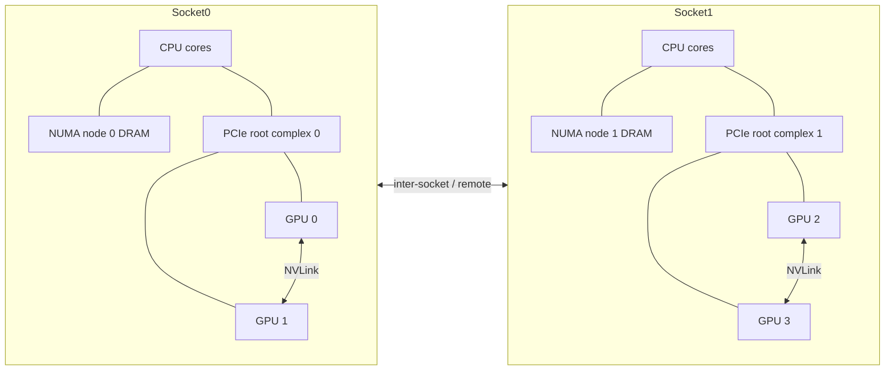
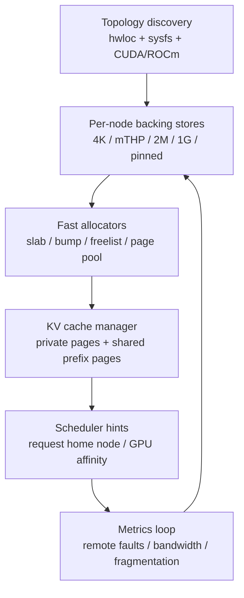

## Executive Summary

This report evaluates the case for building an open-source Rust project around **NUMA-aware memory allocation for AI inference** on **Linux x86_64 multi-socket servers with GPUs**, with a particular focus on **LLM KV-cache management**, **CPU/GPU locality**, and **allocator architecture**. Under those assumptions, the technical opportunity is real: Linux already exposes the necessary primitives through `mmap`, `mbind`, `set_mempolicy`, `move_pages`, `madvise`, `mlock`, HugeTLB, THP, cpusets, and page migration interfaces; modern serving stacks already demonstrate that KV-cache layout, paging strategy, and batching policy are first-order performance determinants; and allocator research has matured enough that there are well-understood building blocks for per-thread arenas, message-passing remote frees, page pools, and fragmentation control.

The core design conclusion is that a good MVP should **not** try to replace the whole system allocator first. A stronger path is to build a domain allocator crate - the prior discussion’s **`inferalloc`** idea - with a narrow but powerful scope: topology discovery, NUMA-aware page pools, request-affine arenas, KV-cache paging, GPU-near pinned host buffers, and profiling hooks. Rust is a good fit because its ownership model makes region lifetimes, request-scoped cleanup, and arena discipline practical, while `#[global_allocator]` and `GlobalAlloc` allow optional process-wide installation when desired. At the same time, the stable Rust ecosystem still treats the more general allocator API as experimental/unstable in the standard library, so the project should be designed as a crate-first runtime component rather than assuming full allocator-polymorphic collection support everywhere.

The most important systems insight is that **locality has to be managed at multiple granularities simultaneously**: CPU-to-DRAM NUMA locality, CPU-to-GPU PCIe/root-complex locality, GPU-to-GPU topology, TLB behavior, fragmentation state, and request scheduling. Linux’s “local allocation,” `MPOL_BIND`, `MPOL_PREFERRED_MANY`, and `MPOL_WEIGHTED_INTERLEAVE` already encode pieces of that policy space; hardware-topology libraries such as hwloc expose NUMA nodes, PCI devices, and CUDA/ROCm device locality; and GPU data-transfer guidance strongly favors page-locked host buffers for high-bandwidth copies and async transfers. An allocator for inference must therefore act less like classic `malloc` and more like a **memory placement runtime**.

My overall recommendation is to position the project as an umbrella called **Locus** or **Nodus**, with **`inferalloc`** as the Rust crate name. The best v1 goal is a reusable library that can sit under a custom inference server or be embedded into engines such as a vLLM-like runtime, rather than a monolithic server. The highest-confidence MVP features are: topology discovery, per-node arenas, paged KV-cache blocks, fixed request affinity, hugepage-aware large-object pools, per-GPU pinned staging arenas, remote-free batching, and a measurement harness built around `perf`, `numastat`, `pagemap`, and eBPF/BCC.
## Project Framing and Scope

The project goal synthesized from the prior discussion is straightforward: build an **open-source Rust memory subsystem for AI inference** that improves **tokens/sec**, **tail latency**, and **effective batch size** by making memory placement and reclamation explicitly aware of **NUMA**, **GPU locality**, and **KV-cache dynamics**. The natural product split is an umbrella project name - **Locus** if you want the “place/locality” metaphor, **Nodus** if you want the “node/topology” metaphor - and a practical crate name, **`inferalloc`**, for the allocator/runtime library itself.

For this report, the baseline assumptions are intentionally narrow because allocator design is highly target-dependent: **Linux**, **x86_64**, **multi-socket servers**, **local DRAM NUMA**, **discrete NVIDIA or AMD GPUs**, inference-heavy workloads dominated by **LLM decode** and **KV-cache growth**. Linux documents explicitly frame NUMA in terms of nodes with differing locality/performance and now even expose target/initiator access classes for CPUs and I/O initiators, which is precisely the substrate such a project needs. citeturn10view17turn11view12

The right project boundary is also shaped by what **not** to do initially. Libnuma’s page-oriented allocation interfaces are relatively slow compared with ordinary `malloc` and are recommended only for large multi-page areas; that makes them excellent control primitives for backing stores and arenas, but poor choices for every tiny allocation on the hot path. Similarly, HugeTLB and THP are useful but need careful scoping: huge pages can reduce TLB pressure and page-fault frequency, yet they come with fragmentation, reclaim, and compaction tradeoffs. A production design should therefore treat NUMA policy and hugepage policy as **backing-store controls**, then layer fast domain allocators on top. citeturn28view1turn10view3turn26view1turn26view0

## Foundations

NUMA matters because memory access cost is not uniform: Linux’s NUMA documentation explicitly notes that nodes can differ in **bandwidth** and **latency**, and that systems may expose multiple kinds of local and non-local memory targets. On modern servers, that difference is not just socket-to-socket DRAM distance; it also includes whether a CPU is near the PCIe root complex attached to a given GPU, whether two GPUs communicate over PCIe or NVLink, and whether memory traffic passes through additional translation layers such as an IOMMU. citeturn10view17turn22view1turn3search14turn36view1turn37view0

Linux’s NUMA policy surface is richer than the usual “bind vs interleave” shorthand. The kernel documents and man pages distinguish `MPOL_BIND`, `MPOL_PREFERRED`, `MPOL_PREFERRED_MANY`, `MPOL_LOCAL`, `MPOL_INTERLEAVE`, and `MPOL_WEIGHTED_INTERLEAVE`. `MPOL_BIND` restricts allocations to a node set; `MPOL_PREFERRED_MANY` prefers a mask but can fall back more broadly under pressure; `MPOL_LOCAL` allocates on the node of the CPU that triggered the fault; and weighted interleave allocates pages according to user-configured ratios. Crucially, for anonymous memory the policy takes effect when a page is **first touched**, and page interleave/weighted-interleave are page-fault-time behaviors, not abstract promises over already-materialized pages. citeturn30view0turn30view2turn29view2turn29view1turn10view0

That first-touch behavior is often underappreciated in serving systems. The `mbind` man page notes that policy mostly affects **new allocations**, while already-touched pages require explicit migration flags such as `MPOL_MF_MOVE` or `MPOL_MF_MOVE_ALL` to be relocated. It also notes that for anonymous mappings, an initial read can use the kernel’s shared zero page, so naïve “touch every page once” strategies may not enforce real placement until the first write or explicit prefault/write pass. This is exactly why allocator-controlled **pre-touch** and **write-touch** strategies can matter for large CPU-side buffers and pinned staging memory. citeturn11view0turn11view1turn10view0

At the syscall level, the important user-space tools are `mmap`, `mbind`, `set_mempolicy`, `get_mempolicy`, `move_pages`, `migrate_pages`, `madvise`, and `mlock`. `mmap` provides `MAP_HUGETLB`, `MAP_POPULATE`, `MAP_LOCKED`, and `MAP_FIXED_NOREPLACE`; `mlock` prevents paging to swap; `madvise` exposes `MADV_HUGEPAGE`, `MADV_NOHUGEPAGE`, and `MADV_COLLAPSE`; `move_pages` and `migrate_pages` allow explicit relocation and residency inspection; and `get_mempolicy` can report the NUMA node for a page and the currently active policy. These are enough to build a serious allocator/runtime without any kernel patches. citeturn25view0turn14search0turn11view3turn26view3turn24view1turn24view2turn24view4

Huge pages require careful segmentation by use case. HugeTLB/`hugetlbfs` uses reserved pools of physically contiguous memory and is excellent when allocations are large, predictable, and long-lived. Transparent Huge Pages are easier to adopt and can reduce page-fault frequency and TLB miss costs; modern kernels also support **multi-size THP** that trades some of the benefit of PMD-sized pages for lower latency spikes and less aggressive compaction. But THP behavior is dynamic, controlled through sysfs, `madvise`, and `prctl`, and even “never” is not absolute because `MADV_COLLAPSE` can still collapse ranges. In short: huge pages are beneficial for read-mostly weights and other stable large regions; they are riskier for highly fragmented, churn-heavy KV-cache pages. citeturn10view3turn11view9turn10view4turn26view0turn26view1turn26view2turn26view3

Linux’s kernel behavior can either help or interfere. Automatic NUMA balancing is page-fault based and can move pages toward nodes that access them often, and libnuma even exposes a helper to combine membind masks with balancing. But cpusets constrain both scheduling and memory placement, and the kernel will silently restrict requested CPUs/nodes to those allowed by the process’s cpuset. Inference runtimes should therefore treat **cpuset/cgroup placement as the outer policy envelope** and allocator policy as an inner refinement. citeturn10view6turn11view2turn10view2turn24view3

Page migration is a critical control plane for long-lived allocations. The kernel documentation and man pages make clear that pages can be moved manually via `mbind(..., MPOL_MF_MOVE*)`, `move_pages()`, or `migrate_pages()`, and that migration is useful when a scheduler has moved a task away from the memory it originally touched. For inference systems, that suggests a useful design principle: **either preserve request affinity so migration is rare, or measure remote-access drift and migrate in batches during safe points**. citeturn24view0turn24view1turn24view2

Hardware locality needs to be made explicit at startup. hwloc can discover NUMA nodes, caches, packages, I/O devices, PCI hierarchies, and CUDA/ROCm objects, and can report the locality of I/O devices on Linux. NVIDIA’s topology-aware guidance says GPU assignment should account for actual system GPU topology and communication channels; NVIDIA’s documentation also frames NVLink specifically as a higher-bandwidth, lower-latency interconnect designed to overcome PCIe limitations. A serious allocator/runtime should therefore construct a **weighted topology graph** once and make all page-pool, scheduler, and staging-buffer decisions against that graph. citeturn23view0turn23view1turn22view1turn3search14

Pinned memory is indispensable whenever CPU↔GPU transfer rate matters. NVIDIA’s CUDA best-practices guide states plainly that page-locked host memory achieves the highest host-device transfer bandwidth and that `cudaMemcpyAsync()` requires pinned host memory. GPUDirect RDMA documentation further explains that DMA-capable transfers require memory pinning so the driver can translate virtual ranges to page lists and program the device’s DMA engines; long-term DMA pinning is also special enough in Linux that the kernel distinguishes `FOLL_PIN` and `FOLL_LONGTERM`, with dedicated accounting and caveats. Those facts strongly support a design with **dedicated pinned staging arenas** rather than ad hoc pin/unpin around every transfer. citeturn35search1turn35search3turn37view2turn37view3

IOMMU and DMA constraints are real operational concerns, not just theory. Linux’s `iommufd` exposes IO address spaces, IOVA alignment, and allowed ranges that can change as devices attach or detach; NVIDIA’s GPUDirect Storage guide additionally warns that on many systems the IOMMU can make GDS fail or perform poorly. That does not mean “disable the IOMMU everywhere” as a universal rule, but it does mean the allocator/runtime should record the environment and adapt its pinned-memory and DMA strategy accordingly. citeturn36view1turn37view0

Finally, cache/TLB behavior deserves direct treatment. The kernel’s THP documentation ties large pages to lower fault frequency and fewer TLB misses; mTHP exists precisely because PMD-sized page promotion can create latency spikes. Separate research on page coloring shows why physical page placement can affect cache conflicts on real-indexed caches, while classic Linux VM commentary notes that Linux does **not** generally color user-page allocations by physical address, though slab coloring improves line usage within slab caches. For this project, page coloring should be treated as an **optional experimental optimization for specialized pools**, not a default foundational mechanism. citeturn26view1turn26view2turn33view1turn34view1turn34view2



## Literature and Systems Survey

The allocator literature converges on a few enduring lessons. **Hoard** showed that multithreaded allocators must explicitly address allocator-induced false sharing and producer/consumer patterns, because naïve designs can scale poorly and create memory blow-ups. **jemalloc** operationalized size classes, arenas, tcaches, per-thread arena assignment, explicit arenas, and decay/purging controls. **TCMalloc** organizes its design into front-end, middle-end, and back-end layers, with modern per-CPU fast paths built on restartable sequences. **mimalloc** pushes locality and contention reduction through page-level sharding and multiple free lists, while **snmalloc** and related work emphasize lock-free/message-passing handling of remote frees. All of these are highly relevant because inference systems routinely allocate on one thread and reclaim on another, especially when networking, batching, scheduler threads, and decode workers are separated. citeturn20view7turn31view1turn31view2turn20view4turn20view3turn20view5turn20view6turn32view0turn27search12turn20view11

For Rust specifically, two integration paths are available. The simple path is global replacement via `#[global_allocator]` and a `GlobalAlloc` implementation. The more flexible path - allocator-polymorphic collections based on the standard `Allocator` trait - remains experimental/unstable in the standard library. That means `inferalloc` should expose both a **domain-specific safe API** and, optionally, a `GlobalAlloc` shim for experiments, but should not assume the whole Rust data-structure ecosystem is allocator-parametric on stable Rust. citeturn21view0turn21view1turn21view2

On the AI-serving side, the prior art is especially strong. The **PagedAttention/vLLM** paper explains why contiguous KV-cache storage causes severe internal and external fragmentation: request context lengths are not known a priori, cache lifetimes vary, and pre-reserving maximum-length contiguous regions wastes memory and constrains batch size. PagedAttention’s core insight is to page the KV cache and allocate blocks on demand, which directly improves effective batching and throughput. citeturn15view1turn15view2turn15view3

The next wave of work shows both the power and the cost of that approach. **vAttention** argues that PagedAttention fixes physical-memory fragmentation by giving up virtual contiguity, which in turn complicates kernels and adds runtime overhead. Its proposed alternative is to keep a contiguous virtual layout while dynamically backing it with physical memory via CUDA VMM, including ahead-of-time allocation overlap and deferred reclamation; notably, the paper reports that smaller 64 KiB pages did not show evidence of TLB thrashing in its setting. That is an important warning for CPU-side design too: **paged KV caches are correct directionally, but page size and page-table shape matter**. citeturn16view0

KV-cache reuse is now an equally important axis. **SGLang/RadixAttention** shows that prefix sharing can reduce memory usage, increase maximum batch size, and cut prefill work by organizing KV cache as a radix tree and reusing shared prefixes. **FlashInfer** goes further in unifying paged KV representations with a block-sparse view, explicitly drawing a conceptual connection between page tables and sparse-matrix structure. Taken together, that suggests a CPU-side allocator for inference must recognize two very different memory classes: **private, append-only decode state** and **shared, read-mostly prefix state**. These classes should not live in the same pool or follow the same eviction policy. citeturn15view4turn15view5turn7search1

The batching literature and practice also matter because allocation pressure is scheduler-induced. Fine-grained or continuous batching increases throughput, but it also increases churn in request metadata, page-table entries, and partial KV pages. That means allocator fast paths need to be optimized for **frequent small metadata allocation**, **steady page-block append**, and **burst deallocation at request completion**, rather than for arbitrary desktop/server mixes. PagedAttention’s discussion of flexible batching and the KV-cache literature around prefix reuse both support this workload model. citeturn15view1turn15view2turn15view4

## Proposed Architecture and Postulates

The architecture proposed here treats the allocator as a **topology-aware memory runtime** with four layers: topology discovery, backing-store managers, request/KV allocators, and scheduler feedback. The design goal is to keep allocation decisions local and cheap on the hot path, while moving expensive work - page migration, compaction, replication, purging, telemetry - to background or safe-point paths.



### Topology-weighted placement

**Postulate:** the allocator should choose a *home NUMA node* per request using a cost model that combines CPU affinity, GPU attachment, and current node pressure, then allocate the request’s CPU-side state and private KV metadata from that node by default.

**Rationale:** Linux already exposes policy modes for strict binding, local allocation, preferred masks, and weighted interleave. hwloc and NVIDIA topology tooling expose the hardware graph. A runtime that ignores this and lets first touch happen wherever a worker lands will get accidental placement rather than designed placement. citeturn30view0turn30view2turn29view2turn23view0turn22view1

**Algorithmic sketch:** compute a score
`score(node) = α * cpu_distance(worker_cpu,node) + β * gpu_path_cost(node,gpu) + γ * pressure(node) + δ * remote_bw_penalty(node)`
Pick the lowest-scoring node as `home_node`. Use `MPOL_BIND` for private request arenas and `MPOL_PREFERRED_MANY` when the best node is pressured but a near-neighbor mask exists. Periodically recompute only when telemetry indicates excessive remote misses.

**Rust-style API**
```rust
pub struct RequestAffinity {
    pub worker_cpu: usize,
    pub gpu: Option<GpuId>,
    pub qos: QoSClass,
}

pub enum PlacementPolicy {
    Bind(NodeMask),
    PreferredMany(NodeMask),
    Local,
    WeightedInterleave(NodeWeights),
}

pub fn choose_home_node(
    topo: &Topology,
    affinity: &RequestAffinity,
    node_stats: &NodeStats,
) -> PlacementPolicy;
```

**Complexity and concurrency:** node selection is `O(N)` over NUMA nodes at admission time, which is cheap because `N` is usually small. Hot-path allocation remains `O(1)` from a home-node arena or page pool.

**Safety boundary:** policy computation is safe Rust; applying it crosses into `unsafe` FFI around `set_mempolicy`, `mbind`, `sched_setaffinity`, and libnuma/syscall wrappers.

**Pitfalls:** if workers are freely stolen across sockets, request-home placement loses value. This theory depends on scheduler cooperation.

### Hybrid bind and weighted interleave

**Postulate:** inference memory should be split into classes with different policies: **bind** for request-private, latency-sensitive state; **weighted interleave** for large read-mostly regions; **preferred-many** for elastic large-object pools.

**Rationale:** Linux explicitly supports weighted interleave and preferred-many, and libnuma documents that interleave is page-granular and useful only for large multi-page areas. That matches the natural distinction between small control-path allocations and large weight/prefix data. citeturn29view2turn29view1turn28view1

**Algorithmic sketch:**
- Metadata, sequence state, sampler buffers: `BIND(home_node)`
- Large immutable tables and optional CPU-side weight shards: `WEIGHTED_INTERLEAVE({near_nodes}, weights)`
- Large temporary workspaces: `PREFERRED_MANY({home_node, sibling_node})`

**Rust-style API**
```rust
pub enum MemoryClass {
    RequestMeta,
    KvPrivate,
    KvSharedPrefix,
    ReadMostlyLarge,
    TempWorkspace,
}

pub struct AllocHint {
    pub class: MemoryClass,
    pub preferred_gpu: Option<GpuId>,
    pub lifetime: LifetimeHint,
}

pub trait InferAlloc {
    fn alloc(&self, layout: Layout, hint: AllocHint) -> Result<NonNull<u8>, AllocError>;
    unsafe fn dealloc(&self, ptr: NonNull<u8>, layout: Layout, hint: AllocHint);
}
```

**Complexity and concurrency:** class lookup is constant time; the primary cost is on page faults or pool refill.

**Safety boundary:** `unsafe` is limited to backing-store creation and returning raw pointers. The class-policy mapping remains safe.

**Pitfalls:** overusing interleave can dilute locality, especially for decode loops with hot CPU reuse; weighted interleave should never be the default for small allocations.

### Hierarchical page pools with hugepage stratification

**Postulate:** the allocator should maintain independent pools for **4 KiB**, **mTHP-sized folios**, **2 MiB huge pages**, **1 GiB huge pages**, and **page-locked host buffers**, instead of a single general heap.

**Rationale:** HugeTLB and THP have different reservation, compaction, and fault behaviors; Linux exposes them separately because they are materially different mechanisms. The KV-cache literature likewise shows that one page size is not uniformly best for all memory classes. citeturn10view3turn10view4turn26view0turn16view0

**Algorithmic sketch:**
- 4 KiB pool: metadata, freelists, small objects
- mTHP pool: medium stable arenas with moderate locality benefit and limited collapse cost
- 2 MiB pool: large read-mostly regions and stable per-layer scratch
- 1 GiB pool: opt-in for very large immutable mappings only
- pinned host pool: staging buffers adjacent to GPU-attached CPU nodes

Each pool is per-node, with a small local cache per thread/core and a larger node-shared refill structure.

**Rust-style API**
```rust
pub enum PageKind {
    Base4K,
    Folio64K,
    Huge2M,
    Huge1G,
    PinnedHost,
}

pub struct PagePoolConfig {
    pub node: NodeId,
    pub kind: PageKind,
    pub reserve_pages: usize,
    pub madvise_huge: bool,
}

pub struct PagePool { /* opaque */ }

impl PagePool {
    pub fn acquire_page(&self) -> Option<PageHandle>;
    pub fn release_page(&self, page: PageHandle);
}
```

**Complexity and concurrency:** acquire/release are `O(1)` on the fast path. Refill from the node pool is amortized `O(1)`. Background purge/compaction is proportional to the number of empty runs/pages examined.

**Safety boundary:** hugepage mappings, `mlock`, pinned-memory registration, and direct syscalls are `unsafe`. Page handles, ownership, and node accounting should remain safe and typed.

**Pitfalls:** too many pool kinds increase stranded memory. The MVP should support only `4K`, `2M`, and `PinnedHost`, with mTHP as experimental.

### Request-affine paged KV design

**Postulate:** private KV cache should be paged into fixed-size blocks owned by the request’s home node and split from shared-prefix KV pages.

**Rationale:** PagedAttention shows why monolithic contiguous KV allocations fragment badly; RadixAttention shows why shared prefixes deserve separate treatment; FlashInfer shows why page tables are the right abstraction boundary. citeturn15view1turn15view2turn15view4turn15view5

**Algorithmic sketch:** maintain:
- `KvPrivateArena`: append-only page blocks per active request
- `KvSharedStore`: immutable/shared prefix pages, reference-counted or epoch-protected
- `KvPageTable`: logical token ranges → physical page handles

On decode append, allocate from the home node’s private page pool. On prefix hit, splice in shared pages without copying. On request completion, bulk drop the private arena.

**Rust-style API**
```rust
pub struct SequenceId(u64);

pub struct KvLayout {
    pub tokens_per_page: u16,
    pub layers: u16,
    pub heads: u16,
    pub head_dim: u16,
}

pub struct KvHandle { /* page-table root */ }

pub trait KvStore {
    fn open_sequence(&self, seq: SequenceId, home: NodeId, layout: KvLayout) -> KvHandle;
    fn append_token_block(&self, kv: &mut KvHandle, n_tokens: u16) -> Result<(), AllocError>;
    fn attach_shared_prefix(&self, kv: &mut KvHandle, prefix: PrefixId) -> bool;
    fn close_sequence(&self, kv: KvHandle);
}
```

**Complexity and concurrency:** append is amortized `O(1)`; lookup in a page table is `O(1)` or `O(log B)` depending on representation; bulk free is `O(p)` in number of pages, but can be near-constant with region ownership and deferred recycle.

**Safety boundary:** page-table metadata can be safe Rust. Any FFI into GPU kernels or cross-process shared mappings is `unsafe`.

**Pitfalls:** page size too small increases TLB and metadata overhead; page size too large increases internal waste. The right answer is workload-dependent and must be benchmarked.

### GPU-near pinned staging arenas

**Postulate:** host buffers used for H2D/D2H transfers should be allocated from long-lived, page-locked arenas placed on the CPU node closest to the target GPU or NIC.

**Rationale:** NVIDIA documents that pinned memory delivers the highest host-device bandwidth and is required for async copies. Linux and CUDA also make clear that DMA pinning is a special resource with system consequences. Therefore, pin/unpin should be amortized, and buffer ownership should be explicit. citeturn35search1turn35search3turn37view2turn37view3

**Algorithmic sketch:** at startup, for each GPU create a pinned arena on the nearest CPU node. Partition it into size classes for common transfer buffers. Export stream-aware borrow/return operations so the buffer is not recycled until the transfer’s completion event fires.

**Rust-style API**
```rust
pub struct PinnedBuf {
    pub ptr: NonNull<u8>,
    pub len: usize,
    pub gpu: GpuId,
}

pub trait PinnedArena {
    fn acquire(&self, gpu: GpuId, size: usize, stream: StreamId) -> Result<PinnedBuf, AllocError>;
    fn release_after_event(&self, buf: PinnedBuf, event: EventId);
}
```

**Complexity and concurrency:** `O(1)` or `O(log S)` by size class. Completion is asynchronous but user-visible lifetime is explicit.

**Safety boundary:** page-locking/registration, CUDA host alloc/register APIs, and event callbacks are `unsafe`. The public handle type should prevent use-after-release.

**Pitfalls:** pinned memory reduces system flexibility and can hurt the OS if overused. This pool must be capped aggressively.

### Lockless remote-free repatriation

**Postulate:** deallocations that occur on a different thread or node than allocation should be returned to the owning arena in **batched, lockless queues**, not directly freed into the local arena.

**Rationale:** Hoard identified producer/consumer and false-sharing pathologies; snmalloc’s message-passing design and mimalloc’s remote-free structures show that batching remote deallocation is a powerful general technique. In inference servers, this fits naturally because request completion often happens on different runtime threads than allocation. citeturn20view7turn27search12turn32view0

**Algorithmic sketch:** every arena owns an MPSC remote-free queue per size-class family or per page-run family. Cross-thread free enqueues a compact descriptor; the owner drains on refill, on periodic heartbeat, or when queue depth exceeds a threshold.

**Rust-style API**
```rust
pub struct RemoteFreeToken {
    owner_arena: ArenaId,
    ptr: NonNull<u8>,
    size_class: u16,
}

pub trait RemoteFree {
    fn free_remote(&self, token: RemoteFreeToken);
    fn drain_remote(&self, arena: ArenaId, budget: usize);
}
```

**Complexity and concurrency:** enqueue is `O(1)` lock-free; drain is `O(k)` for `k` returned objects and can be budgeted to smooth latency.

**Safety boundary:** ABA-safe intrusive queues or tagged pointers may require `unsafe`. The public API should hide raw node-pointer manipulation behind sealed internals.

**Pitfalls:** if drain cadence is too low, memory appears artificially inflated; if too aggressive, owner threads spend too much time draining.

### Scheduler-cooperative locality and small-scale replication

**Postulate:** the allocator should expose locality hints to the scheduler, and should optionally replicate *small*, read-mostly CPU-side structures across near nodes when telemetry shows remote-read domination.

**Rationale:** Linux’s own migration guidance assumes page movement is a response to scheduler movement; cpusets and NUMA balancing already tie scheduling and memory placement together. Prefix caches and template prompts are often read-many structures where small duplication can be cheaper than repeated remote access. citeturn24view0turn24view3turn15view4

**Algorithmic sketch:** maintain per-object heat and remote-read counters. If a structure is below a size threshold and remote hits exceed a threshold for a sustained window, replicate to a sibling node and redirect future readers on that node. For larger structures, prefer migration or shared access; do not replicate blindly.

**Rust-style API**
```rust
pub enum ShareMode {
    SingleOwner,
    ReplicatedSmall,
    SharedReadMostly,
}

pub struct LocalityAdvice {
    pub preferred_node: NodeId,
    pub stay_put: bool,
    pub share_mode: ShareMode,
}
```

**Complexity and concurrency:** replication decision is off the hot path; reads remain `O(1)`. The main complexity is maintaining versioning/immutability discipline.

**Safety boundary:** safe Rust is feasible if replicated objects are immutable or epoch-replaced; mutable shared replicas would substantially complicate correctness and should be excluded from MVP.

**Pitfalls:** replication wastes memory and can thrash if driven by short-lived phases. Apply only to small, immutable, high-hit-rate objects.

## Implementation Plan and APIs

The crate should be layered so that most users never touch raw NUMA syscalls directly.

| Layer | Responsibility | Safe/unsafe split |
|---|---|---|
| `topology` | hwloc/sysfs/CUDA/ROCm discovery, node distances, GPU attachment maps | Mostly safe API over unsafe FFI |
| `policy` | admission-time placement, memory-class routing, scheduler hints | Safe |
| `backing` | `mmap`, `mbind`, HugeTLB, THP hints, `mlock`, pinned registration | Unsafe internals, safe handles |
| `pool` | per-node page pools, per-thread caches, hugepage pools, remote-free queues | Mixed |
| `kv` | paged private KV, shared-prefix store, compaction/eviction hooks | Safe public API |
| `metrics` | `numastat`, `pagemap`, perf/eBPF integration, allocator stats | Safe wrapper layer plus FFI/shell integration |

A minimal but high-leverage public API could look like this:

```rust
pub struct Inferalloc {
    topo: Arc<Topology>,
    cpu_arenas: ArenaSet,
    kv: KvRuntime,
    pinned: PinnedRuntime,
}

impl Inferalloc {
    pub fn new(cfg: Config) -> Result<Self, InitError>;
    pub fn begin_request(&self, req: RequestAffinity) -> RequestCtx;
    pub fn end_request(&self, ctx: RequestCtx);
}

pub struct RequestCtx {
    pub home_node: NodeId,
    pub placement: PlacementPolicy,
    // arena references hidden
}

impl RequestCtx {
    pub fn alloc_meta<T>(&self, value: T) -> AllocBox<T>;
    pub fn open_kv(&self, layout: KvLayout) -> KvHandle;
    pub fn stage_for_gpu(&self, gpu: GpuId, size: usize, stream: StreamId) -> Result<PinnedBuf, AllocError>;
}
```

The internal allocator patterns should be intentionally heterogeneous:

| Allocation class | Recommended pattern | Why |
|---|---|---|
| tiny request metadata | per-thread slab / segregated-fit | minimal latency, predictable reuse |
| medium transient objects | per-node size-class freelists | avoids global contention |
| append-only request state | bump/region allocator | bulk teardown at request end |
| KV private pages | fixed-size page pool | stable metadata, bounded fragmentation |
| KV shared prefixes | immutable page graph + refcounts/epoch GC | reuse and safe sharing |
| large stable mappings | hugepage-aware extent allocator | TLB/fault benefits |
| pinned staging buffers | ring or slab inside pinned arena | avoids pin/unpin churn |

The `unsafe` boundary is manageable if disciplined. It should be confined to:
- FFI and syscalls (`mmap`, `mbind`, `madvise`, `mlock`, libnuma, hwloc, CUDA/ROCm)
- pointer arithmetic inside slabs/page metadata
- lock-free intrusive lists or tagged-pointer queues
- direct exposure of registered/pinned external memory

Everything else - handles, arenas, node IDs, page ownership, request contexts, page-table metadata - should be expressed in safe Rust, with drop semantics used for bulk cleanup where possible.

A realistic roadmap from **v0.1 to v1.0** is:

| Milestone | Scope |
|---|---|
| `v0.1` | topology discovery, node distances, per-node 4K/2M pools, request admission API |
| `v0.2` | request-scoped bump/slab allocators, typed metadata allocation, basic stats |
| `v0.3` | private paged KV cache, bulk request teardown, `numa_maps`/`numastat` export |
| `v0.4` | pinned per-GPU staging arenas, async release hooks, transfer-aware metrics |
| `v0.5` | remote-free batching, sharded global refill, lock-contention tracing |
| `v0.6` | THP/HugeTLB policies, opt-in mTHP experiments, page pre-touch and prefault modes |
| `v0.7` | shared-prefix KV store, immutable prefix dedup, simple LRU eviction |
| `v0.8` | scheduler hints, request-home persistence, optional page migration on safe points |
| `v0.9` | adaptive interleave/bind switching, fragmentation telemetry, compaction heuristics |
| `v1.0` | production hardening, crash-safe metrics, docs, integration examples, benchmark suite |

## Evaluation Methodology and Recommended MVP

A credible evaluation plan needs both **synthetic** and **realistic** workloads. Synthetic tests are needed because allocator bugs and pathologies are workload-shaped; real serving traces are needed because many allocator wins only appear when batching, prefix reuse, and scheduler behavior interact. That lesson appears repeatedly in allocator and serving literature, including Hoard’s producer/consumer focus, mimalloc’s mixed benchmark suite, and vLLM’s trace-based evaluation. citeturn20view7turn32view0turn15view3

The synthetic benchmark set should include:
- **single-user decode growth**: one request appending KV pages steadily
- **multi-user decode**: many similarly sized concurrent sequences
- **batch churn**: rapid admission/completion cycles
- **prefix-heavy**: many requests sharing a prompt template/prefix
- **producer/consumer free**: allocation on one thread, free on another
- **remote-placement stress**: workers intentionally placed away from memory home nodes

The realistic set should include at least two open serving traces or trace generators: a **chat-heavy short/medium decode mix** and a **long-context batch mix**.

The metric set should be broader than “tokens/sec.” At minimum, collect:
- throughput: **tokens/sec**, **requests/sec**
- latency: **TTFT**, **p50/p95/p99 per token**, **end-to-end request latency**
- locality: **local vs remote page placements**, **NUMA hits/misses**, **page migration counts**
- memory behavior: **major/minor faults**, **THP collapse/fallback counters**, **fragmentation ratio**, **free-but-unreclaimable bytes**, **remote-free backlog**
- microarchitecture: **cycles**, **instructions**, **cache misses**, **TLB misses**, **memory-load latency samples**
- transfer path: **H2D/D2H bandwidth**, **pinned-pool occupancy**, **DMA pin lifetime**

Linux and vendor tooling already supports most of this. `numastat` provides per-node and per-process allocation distribution; `pagemap` exposes virtual→physical mapping details; `perf stat` gives PMU counters; `perf mem` samples memory access latency; Intel MLC measures local/cross-socket bandwidth and latency; STREAM measures sustainable memory bandwidth; and BCC/eBPF provides dynamic tracing infrastructure for allocator and page-fault events. citeturn22view6turn22view5turn18search2turn18search18turn22view7turn19search14turn18search7

A good experiment matrix should vary all of the following:

| Dimension | Values |
|---|---|
| sockets | 1, 2, 4 |
| NUMA nodes per socket | platform default, BIOS variants if available |
| GPU topology | same-root-complex, split-root-complex, NVLink-coupled |
| memory policy | local, bind, preferred-many, weighted interleave |
| page strategy | 4K only, 2M hotspots, mTHP experimental |
| scheduler policy | request-sticky, free-migrate, work-stealing |
| KV design | contiguous baseline, private paged, paged + shared prefix |
| reclamation | immediate free, batched remote free, deferred recycle |
| host-device staging | pageable, ad hoc pinned, per-GPU pinned arena |

For the MVP, I recommend the following defaults:

| Feature area | MVP default | Why |
|---|---|---|
| topology | discover once at startup via hwloc + sysfs | reliable and cheap |
| request placement | sticky home node + bind | simple and high-value |
| small allocations | per-thread slabs on home node | avoids libnuma-in-hot-path overhead |
| KV private pages | fixed blocks from per-node page pools | directly addresses fragmentation |
| shared prefix | postponed until after stable private paging | keep MVP manageable |
| huge pages | 2 MiB opt-in only for large stable arenas | safer than blanket THP |
| THP | `madvise` mode only for selected regions | limits surprise promotions |
| pinned host memory | capped per-GPU arena on nearest node | strong transfer win with bounded risk |
| remote free | batched MPSC return-to-owner | proven pattern for cross-thread frees |
| migration | observe only in MVP; act later | avoid policy flapping early |
| scheduler integration | affinity hints only in MVP | lower integration burden |

If I were prioritizing features strictly by expected ROI for a first public release, the order would be:

| Priority | Capability |
|---|---|
| highest | topology discovery and per-node arenas |
| highest | request-home placement and sticky affinity |
| highest | private paged KV blocks |
| high | per-GPU pinned staging arenas |
| high | remote-free batching |
| medium | 2 MiB large-object pools |
| medium | profiler/export hooks |
| medium | shared-prefix KV store |
| lower | automatic page migration |
| lower | adaptive small-scale replication |
| experimental | page coloring and aggressive compaction |

## Limitations and Open Questions

This report assumes **Linux x86_64 multi-socket servers with GPUs**. The conclusions are directionally useful elsewhere, but the exact syscall surface, hugepage behavior, restartable-sequence availability, and GPU-memory APIs will differ on other platforms. Likewise, this report is strongest on **CPU-side placement and CPU↔GPU staging**; it is not a complete treatment of GPU-resident allocators or all CUDA/ROCm virtual-memory features. citeturn20view3turn16view0

Several questions remain open enough that they should be treated as benchmark targets rather than design axioms. The biggest are the best **KV page size**, the break-even point between **migration and replication**, the right use of **mTHP** for medium-lived arenas, and how much **automatic NUMA balancing** helps or hurts under request-sticky schedulers. Linux provides the mechanisms; only workload-specific measurement can settle the policy. citeturn26view0turn10view6turn24view0

The most important practical caution is that memory locality is a whole-system property. If the scheduler, cpusets/cgroups, GPU assignment, and memory policy are not aligned, allocator cleverness alone will not save the workload. The best version of this project will therefore look less like a standalone `malloc` replacement and more like a **measurement-driven locality subsystem for inference runtimes** - exactly the role that **Locus / Nodus** with an **`inferalloc`** crate can productively fill.